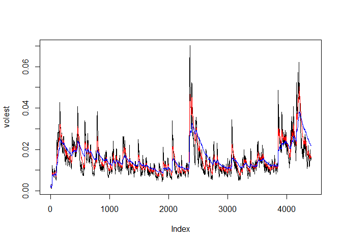
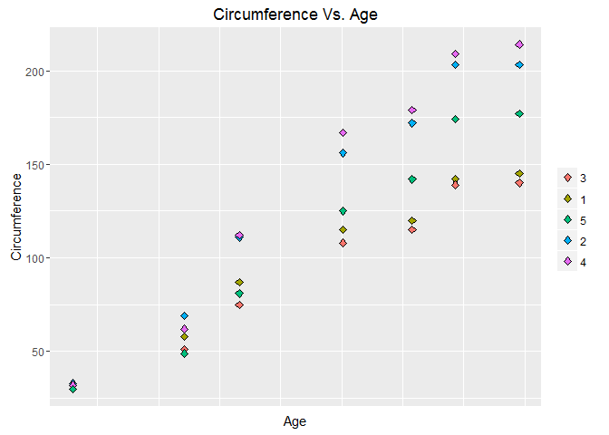
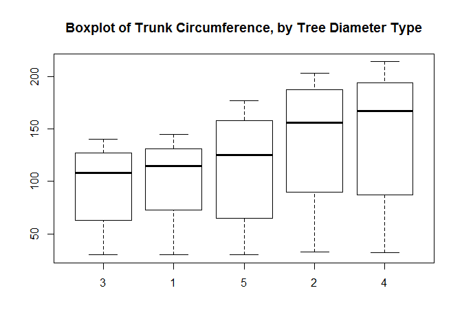
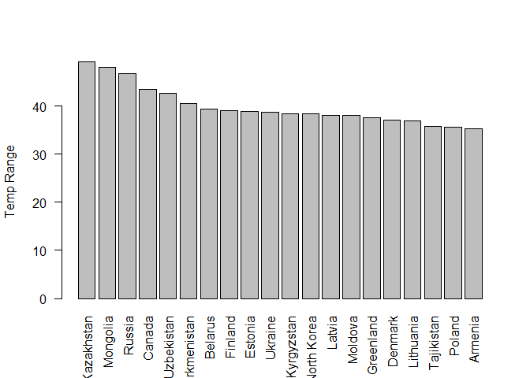
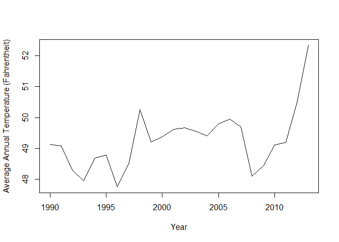
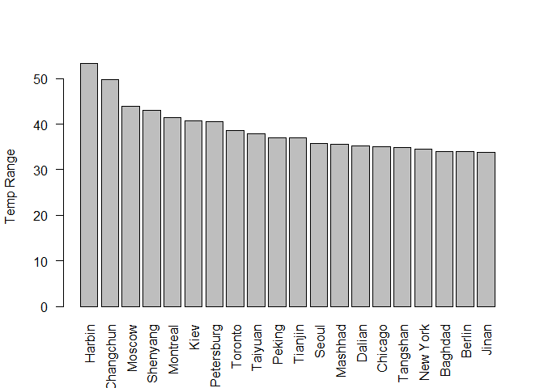

Case Study 2
================
Marc Naples
December 7, 2016

Case Study 2 - Doing Data Science, Fall 2016
============================================

Question 1 - Create Matrix and print it
---------------------------------------

### SAS Version

### R Version

``` r
X = matrix( 
  c(4, 1, 2, 5, 0, 1, 1, 3, 8, 2, 5, 2), 
  nrow=3, 
  ncol=4)
X
```

    ##      [,1] [,2] [,3] [,4]
    ## [1,]    4    5    1    2
    ## [2,]    1    0    3    5
    ## [3,]    2    1    8    2

### Python Version

See Python Jupyter notebook file located on this GitHub project.

Question 2 - Week 11 Lecture Assignment
---------------------------------------

Download the Data

``` r
library(tseries)
```

    ## Warning: package 'tseries' was built under R version 3.3.2

``` r
TCPdata <- get.hist.quote('TCP',quote="Close")
```

    ## time series starts 1999-05-25

Calculate Log Returns

``` r
TCPret <- log(lag(TCPdata)) - log(TCPdata)
TCPvol <- sd(TCPret) * sqrt(250) * 100
```

Calculate Volatility Measure

``` r
getVol <- function(d, logrets)
{
  var = 0
  lam = 0
  varlist <- c()
  for (r in logrets) {
    lam = lam*(1 - 1/d) + 1
    var = (1 - 1/lam)*var + (1/lam)*r^2
    varlist <- c(varlist, var)
  }
  sqrt(varlist)
}
```

Calculate volatility over entire length of series for the different decay factors

``` r
volest <- getVol(10,TCPret)
volest2 <- getVol(30,TCPret)
volest3 <- getVol(100,TCPret)
```

Plot the Results

``` r
plot(volest,type="l")
lines(volest2,type="l",col="red")
lines(volest3, type = "l", col="blue")
```



Question 3 - Orange Data Problems
---------------------------------

### Calculate the mean and the median of the trunk circumference for different size of the trees (Tree)

``` r
# Import data
library(datasets)
data(Orange)

# Calculations
tapply(Orange$circumference, Orange$Tree, mean)
```

    ##         3         1         5         2         4 
    ##  94.00000  99.57143 111.14286 135.28571 139.28571

``` r
tapply(Orange$circumference, Orange$Tree, median)
```

    ##   3   1   5   2   4 
    ## 108 115 125 156 167

### Make a scatterplot of the trunk circumferences against the age of the tree. Use different plotting symbols for different size of trees

``` r
# Reorder Data
Orange$order <- as.factor(rep(c(3,1,5,2,4), each=7))

# Plot
library(ggplot2)
ggplot(Orange, aes(x=age, y=circumference)) + 
  geom_point(size=2, shape=23, aes(fill=Orange$Tree)) + xlab("Age") + ylab("Circumference") + labs("Tree Type)") +
  theme(axis.text.x=element_blank(), axis.ticks.x=element_blank(), legend.title=element_blank()) + ggtitle("Circumference Vs. Age")
```



### Display the trunk circumference on a comparative boxplot against tree (ensure boxplots ordered such that they increase with maximum diameter)

``` r
boxplot(circumference ~ Tree, data = Orange)
title("Boxplot of Trunk Circumference, by Tree Diameter Type")
```



Question 4 - Problems with Temp dataset
---------------------------------------

### Find the idfference between the maximum and minimum monthly average temps for each country and report/visualize top 20 countires with the maximum differences for the period since 1900.

``` r
# Import temp data
setwd('C:/R/CaseStudy2')
temp <- read.csv('temp.csv', header=TRUE)
library(plyr)

## clean data set by remove NAs, rename 'date' to 'month'
cleantemp <- na.omit(temp)
names(cleantemp)[1] <- "month"

## Change month column to date type object with step that only works on dates entered after 1900, remove NAs (thus removing pre-1900 rows)
cleantemp$month <- as.Date(as.character(cleantemp$month), "%m/%d/%Y")
cleantemp <- na.omit(cleantemp)

## calculate mins and maxes for each Country, create new data set with values
maxes <- aggregate(cleantemp$Monthly.AverageTemp, by=list(cleantemp$Country), FUN=max)
mins <- aggregate(cleantemp$Monthly.AverageTemp, by=list(cleantemp$Country), FUN=min)
range <- cbind(maxes, mins)
names(range)[2] <- "max"
names(range)[4] <- "min"

## add column for difference between min and max, sort descending by range, keep only top 20
range$diff <- range$max - range$min
range.sorted <- range[order(-range$diff),]
range.sorted <- range.sorted[1:20, ]

## Plot
barplot(range.sorted$diff, ylab="Temp Range", names.arg=range.sorted$Group.1, las=2)
```



### Select a subset of US tempatures since 1990

``` r
library(dplyr)
```

    ## Warning: package 'dplyr' was built under R version 3.3.2

    ## 
    ## Attaching package: 'dplyr'

    ## The following objects are masked from 'package:plyr':
    ## 
    ##     arrange, count, desc, failwith, id, mutate, rename, summarise,
    ##     summarize

    ## The following objects are masked from 'package:stats':
    ## 
    ##     filter, lag

    ## The following objects are masked from 'package:base':
    ## 
    ##     intersect, setdiff, setequal, union

``` r
UStemp <- subset(cleantemp, Country=="United States" & month >= as.Date("1990-01-01"), select=month:Monthly.AverageTemp)
```

#### Create a new column to display the monthly average land temps in Farhrenheit

``` r
UStemp$ftemp <- with(UStemp, Monthly.AverageTemp * (9/5) + 32)
```

#### Calculate average land temperature by year and plot it

``` r
# Create new column identifying year only of date
UStemp$year <- format(as.Date(UStemp$month, format="%Y-%m-%d"),"%Y")

# Calculate annual mean temps, store to object and convert to dataframe
annualtemps <- tapply(UStemp$ftemp, UStemp$year, mean)
annualdf <- as.data.frame.table(annualtemps)

# Clean data frame
annualdf$Var1 <- as.numeric(annualdf$Var1)
annualdf$Var1 <- with(annualdf, Var1 + 1989)
names(annualdf)[1] <- "Year"
names(annualdf)[2] <- "Temp"

# Plot
plot(annualdf, type="l", xlab=("Year"), ylab=("Average Annual Temperature (Fahrentheit)"))
```



#### Calculate the one year difference of average land temperature and provide maximum different between years

``` r
# Calculate year to year differences from dataframe of annual temps created above
diff(annualdf$Temp)
```

    ##  [1] -0.05025 -0.78720 -0.34035  0.72555  0.10920 -1.03800  0.75345
    ##  [8]  1.74285 -1.03350  0.14895  0.24450  0.05505 -0.10995 -0.15765
    ## [15]  0.40530  0.14730 -0.24660 -1.59495  0.33420  0.66330  0.07980
    ## [22]  1.28010  1.86485

``` r
# Store calculations, add as column of data to dataframe
tempchanges <- diff(annualdf$Temp)
annualdf$diff <- c(NA, tempchanges)
annualdf
```

    ##    Year     Temp     diff
    ## 1  1990 49.13885       NA
    ## 2  1991 49.08860 -0.05025
    ## 3  1992 48.30140 -0.78720
    ## 4  1993 47.96105 -0.34035
    ## 5  1994 48.68660  0.72555
    ## 6  1995 48.79580  0.10920
    ## 7  1996 47.75780 -1.03800
    ## 8  1997 48.51125  0.75345
    ## 9  1998 50.25410  1.74285
    ## 10 1999 49.22060 -1.03350
    ## 11 2000 49.36955  0.14895
    ## 12 2001 49.61405  0.24450
    ## 13 2002 49.66910  0.05505
    ## 14 2003 49.55915 -0.10995
    ## 15 2004 49.40150 -0.15765
    ## 16 2005 49.80680  0.40530
    ## 17 2006 49.95410  0.14730
    ## 18 2007 49.70750 -0.24660
    ## 19 2008 48.11255 -1.59495
    ## 20 2009 48.44675  0.33420
    ## 21 2010 49.11005  0.66330
    ## 22 2011 49.18985  0.07980
    ## 23 2012 50.46995  1.28010
    ## 24 2013 52.33480  1.86485

Examination shows the greatest one year difference to occur in the final row of the dataframe, with temperatures rising from 2012 to 2013.

### Use CityTemp data, find the difference between maximum and minimum temps for each major city and report/visualize top 20 cities since 1900.

``` r
# Import CityTemp
setwd('C:/R/CaseStudy2')
citytemp <- read.csv('CityTemp.csv', header=TRUE)

## clean data set by remove NAs, rename 'date' to 'month'
cleancity <- na.omit(citytemp)
names(cleancity)[1] <- "month"

## Change month column to date type object with step that only works on dates entered after 1900, remove NAs (thus removing pre-1900 rows)
cleancity$month <- as.Date(as.character(cleancity$month), "%m/%d/%Y")
cleancity <- na.omit(cleancity)

## calculate mins and maxes for each city, create new data set with values
citymaxes <- aggregate(cleancity$Monthly.AverageTemp, by=list(cleancity$City), FUN=max)
citymins <- aggregate(cleancity$Monthly.AverageTemp, by=list(cleancity$City), FUN=min)
cityrange <- cbind(citymaxes, citymins)
names(cityrange)[2] <- "max"
names(cityrange)[4] <- "min"

## add column for difference between min and max, sort descending by range, keep only top 20 results
cityrange$diff <- cityrange$max - cityrange$min
cityrange.sorted <- cityrange[order(-cityrange$diff),]
cityrange.sorted <- cityrange.sorted[1:20, ]

## Plot
barplot(cityrange.sorted$diff, ylab="Temp Range", names.arg=cityrange.sorted$Group.1, las=2)
```



#### Compare and comment on City versus Country temp differences

The first thing that can be seen in comparing the graphs is that the City data has the two largest values for temperature difference, with Harbin and Changchun. This is likely because the average temperatures for a country will be regressed to a mean due to the larger area. A single city, however, can reach more extremes.

Second, there is lots of overlap. Many of the top-20 cities are in Northeast China (or neighbors like Seoul in Korea) and in Russia. This makes sense as Russia and Mongolia (China's northern neighbor), are 2 of the top 3 countries for temperature ranges.
