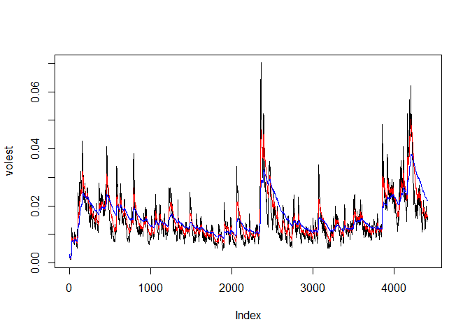
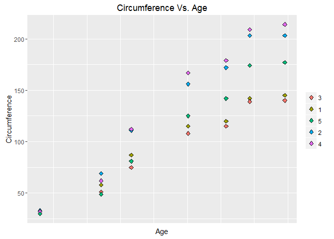
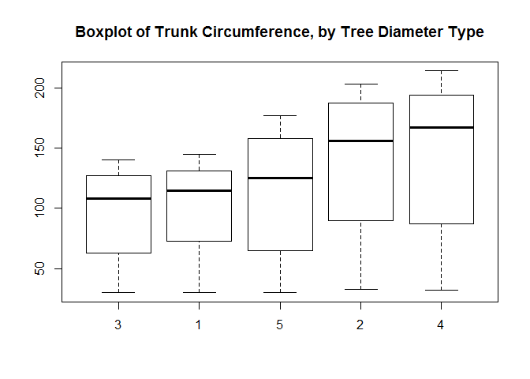
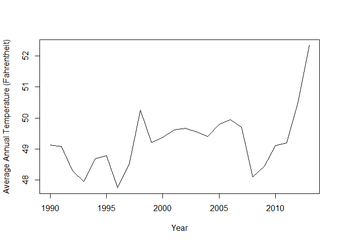

Case Study 2 - Doing Data Science, Fall 2016
============================================

QUestion 1 - Create Matrix and print it
---------------------------------------

### SAS Version

### R Version

    X = matrix( 
      c(4, 1, 2, 5, 0, 1, 1, 3, 8, 2, 5, 2), 
      nrow=3, 
      ncol=4)
    X

    ##      [,1] [,2] [,3] [,4]
    ## [1,]    4    5    1    2
    ## [2,]    1    0    3    5
    ## [3,]    2    1    8    2

### Python Version

See notebook located on this GitHub project.

Question 2 - Week 11 Lecture Assignment
---------------------------------------

Download the Data

    library(tseries)

    ## Warning: package 'tseries' was built under R version 3.3.2

    TCPdata <- get.hist.quote('TCP',quote="Close")

    ## time series starts 1999-05-25

Calculate Log Returns

    TCPret <- log(lag(TCPdata)) - log(TCPdata)
    TCPvol <- sd(TCPret) * sqrt(250) * 100

Calculate Volatility Measure

    getVol <- function(d, logrets)
    {
      var = 0
      lam = 0
      varlist <- c()
      for (r in logrets) {
        lam = lam*(1 - 1/d) + 1
        var = (1 - 1/lam)*var + (1/lam)*r^2
        varlist <- c(varlist, var)
      }
      sqrt(varlist)
    }

Calculate volatility over entire length of series for the different
decay factors

    volest <- getVol(10,TCPret)
    volest2 <- getVol(30,TCPret)
    volest3 <- getVol(100,TCPret)

Plot the Results

    plot(volest,type="l")
    lines(volest2,type="l",col="red")
    lines(volest3, type = "l", col="blue")

Question 3 - Orange Data Problems
---------------------------------

### Calculate the mean and the median of the trunk circumference for different size of the trees (Tree)

    # Import data
    library(datasets)
    data(Orange)

    # Calculations
    tapply(Orange$circumference, Orange$Tree, mean)

    ##         3         1         5         2         4 
    ##  94.00000  99.57143 111.14286 135.28571 139.28571

    tapply(Orange$circumference, Orange$Tree, median)

    ##   3   1   5   2   4 
    ## 108 115 125 156 167

### Make a scatterplot of the trunk circumferences against the age of the tree. Use different plotting symbols for different size of trees

    # Reorder Data
    Orange$order <- as.factor(rep(c(3,1,5,2,4), each=7))

    # Plot
    library(ggplot2)
    ggplot(Orange, aes(x=age, y=circumference)) + 
      geom_point(size=2, shape=23, aes(fill=Orange$Tree)) + xlab("Age") + ylab("Circumference") + labs("Tree Type)") +
      theme(axis.text.x=element_blank(), axis.ticks.x=element_blank(), legend.title=element_blank()) + ggtitle("Circumference Vs. Age")

### Display the trunk circumference on a comparative boxplot against tree (ensure boxplots ordered such that they increase with maximum diameter)

    boxplot(circumference ~ Tree, data = Orange)
    title("Boxplot of Trunk Circumference, by Tree Diameter Type")

Question 4 - Problems with Temp dataset
---------------------------------------

### Find the idfference between the maximum and minimum monthly average temps for each country and report/visualize top 20 countires with the maximum differences for the period since 1900.

    # Import temp data
    setwd('C:/R/CaseStudy2')
    temp <- read.csv('temp.csv', header=TRUE)
    library(plyr)

    ## clean data set by remove NAs, rename 'date' to 'month'
    cleantemp <- na.omit(temp)
    names(cleantemp)[1] <- "month"

    ## Change month column to date type object with step that only works on dates entered after 1900, remove NAs (thus removing pre-1900 rows)
    cleantemp$month <- as.Date(as.character(cleantemp$month), "%m/%d/%Y")
    cleantemp <- na.omit(cleantemp)

    ## calculate mins and maxes for each Country, create new data set with values
    maxes <- aggregate(cleantemp$Monthly.AverageTemp, by=list(cleantemp$Country), FUN=max)
    mins <- aggregate(cleantemp$Monthly.AverageTemp, by=list(cleantemp$Country), FUN=min)
    range <- cbind(maxes, mins)
    names(range)[2] <- "max"
    names(range)[4] <- "min"

    ## add column for difference between min and max, sort descending by range, keep only top 20
    range$diff <- range$max - range$min
    range.sorted <- range[order(-range$diff),]
    range.sorted <- range.sorted[1:20, ]

    ## Plot
    barplot(range.sorted$diff, ylab="Temp Range", names.arg=range.sorted$Group.1, las=2)

### Select a subset of US tempatures since 1990

    library(dplyr)

    ## Warning: package 'dplyr' was built under R version 3.3.2

    ## 
    ## Attaching package: 'dplyr'

    ## The following objects are masked from 'package:plyr':
    ## 
    ##     arrange, count, desc, failwith, id, mutate, rename, summarise,
    ##     summarize

    ## The following objects are masked from 'package:stats':
    ## 
    ##     filter, lag

    ## The following objects are masked from 'package:base':
    ## 
    ##     intersect, setdiff, setequal, union

    UStemp <- subset(cleantemp, Country=="United States" & month >= as.Date("1990-01-01"), select=month:Monthly.AverageTemp)

#### Create a new column to display the monthly average land temps in Farhrenheit

    UStemp$ftemp <- with(UStemp, Monthly.AverageTemp * (9/5) + 32)

#### Calculate average land temperature by year and plot it

    # Create new column identifying year only of date
    UStemp$year <- format(as.Date(UStemp$month, format="%Y-%m-%d"),"%Y")

    # Calculate annual mean temps, store to object and convert to dataframe
    annualtemps <- tapply(UStemp$ftemp, UStemp$year, mean)
    annualdf <- as.data.frame.table(annualtemps)

    # Clean data frame
    annualdf$Var1 <- as.numeric(annualdf$Var1)
    annualdf$Var1 <- with(annualdf, Var1 + 1989)
    names(annualdf)[1] <- "Year"
    names(annualdf)[2] <- "Temp"

    # Plot
    plot(annualdf, type="l", xlab=("Year"), ylab=("Average Annual Temperature (Fahrentheit)"))

#### Calculate the one year difference of average land temperature and provide maximum different between years

    # Calculate year to year differences from dataframe of annual temps created above
    diff(annualdf$Temp)

    ##  [1] -0.05025 -0.78720 -0.34035  0.72555  0.10920 -1.03800  0.75345
    ##  [8]  1.74285 -1.03350  0.14895  0.24450  0.05505 -0.10995 -0.15765
    ## [15]  0.40530  0.14730 -0.24660 -1.59495  0.33420  0.66330  0.07980
    ## [22]  1.28010  1.86485

    # Store calculations, add as column of data to dataframe
    tempchanges <- diff(annualdf$Temp)
    annualdf$diff <- c(NA, tempchanges)
    annualdf

    ##    Year     Temp     diff
    ## 1  1990 49.13885       NA
    ## 2  1991 49.08860 -0.05025
    ## 3  1992 48.30140 -0.78720
    ## 4  1993 47.96105 -0.34035
    ## 5  1994 48.68660  0.72555
    ## 6  1995 48.79580  0.10920
    ## 7  1996 47.75780 -1.03800
    ## 8  1997 48.51125  0.75345
    ## 9  1998 50.25410  1.74285
    ## 10 1999 49.22060 -1.03350
    ## 11 2000 49.36955  0.14895
    ## 12 2001 49.61405  0.24450
    ## 13 2002 49.66910  0.05505
    ## 14 2003 49.55915 -0.10995
    ## 15 2004 49.40150 -0.15765
    ## 16 2005 49.80680  0.40530
    ## 17 2006 49.95410  0.14730
    ## 18 2007 49.70750 -0.24660
    ## 19 2008 48.11255 -1.59495
    ## 20 2009 48.44675  0.33420
    ## 21 2010 49.11005  0.66330
    ## 22 2011 49.18985  0.07980
    ## 23 2012 50.46995  1.28010
    ## 24 2013 52.33480  1.86485

Examination shows the greatest one year difference to occur in the final
row of the dataframe, with temperatures rising from 2012 to 2013.

### Use CityTemp data, find the difference between maximum and minimum temps for each major city and report/visualize top 20 cities since 1900.

    # Import CityTemp
    setwd('C:/R/CaseStudy2')
    citytemp <- read.csv('CityTemp.csv', header=TRUE)

    ## clean data set by remove NAs, rename 'date' to 'month'
    cleancity <- na.omit(citytemp)
    names(cleancity)[1] <- "month"

    ## Change month column to date type object with step that only works on dates entered after 1900, remove NAs (thus removing pre-1900 rows)
    cleancity$month <- as.Date(as.character(cleancity$month), "%m/%d/%Y")
    cleancity <- na.omit(cleancity)

    ## calculate mins and maxes for each city, create new data set with values
    citymaxes <- aggregate(cleancity$Monthly.AverageTemp, by=list(cleancity$City), FUN=max)
    citymins <- aggregate(cleancity$Monthly.AverageTemp, by=list(cleancity$City), FUN=min)
    cityrange <- cbind(citymaxes, citymins)
    names(cityrange)[2] <- "max"
    names(cityrange)[4] <- "min"

    ## add column for difference between min and max, sort descending by range, keep only top 20 results
    cityrange$diff <- cityrange$max - cityrange$min
    cityrange.sorted <- cityrange[order(-cityrange$diff),]
    cityrange.sorted <- cityrange.sorted[1:20, ]

    ## Plot
    barplot(cityrange.sorted$diff, ylab="Temp Range", names.arg=cityrange.sorted$Group.1, las=2)

#### Compare and comment on City versus Country temp differences
